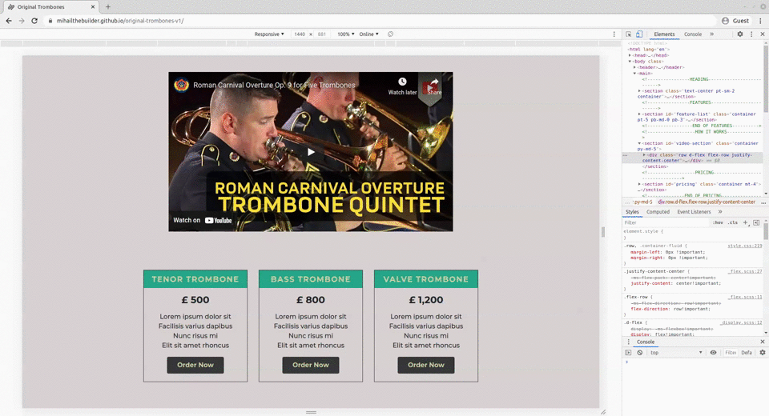
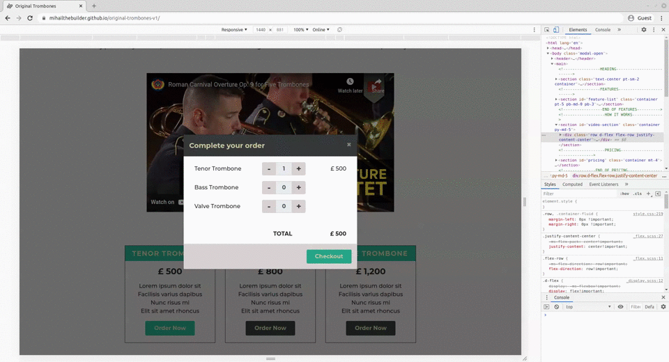

# Original Trombones

## Overview
A static ecommerce landing page built with Bootstrap 4 and jQuery.

## Highlights

### Fully responsive


Very easy to achieve using Bootstrap's grid system. Using its class-based approach, you can set different column widths as well as row orders. A good example can be found for the "Tenor Trombone" grouping in the pop-up checkout modal:
```html
<div id="tenor-group" class="form-group row">
  <!--
    The name of product.
    Screen width...
      ≥ 576px <=> class names...
        col-sm-5 = takes 5/12 of a row
        order-sm-0 = appears 1st in order.
      < 576px <=> class names...
        col-8 = takes 8/12 of a row
        order-0 = still appears 1st in order.
  -->
  <label for="tenor-number" class="col-sm-5 col-8 order-sm-0 order-0 mb-0 flex-row-center">
    Tenor Trombone
  </label>

  <!--
    Quantity with increment & decrement buttons.
    Screen width...
      ≥ 576px <=> class names...
        col-sm-4 = takes 4/12 of a row
        order-sm-1 = appears after product name
      < 576px <=> class names...
        [no col-x] = takes entire row
        order-2 = appears last in the grouping 
  -->
  <div class="col-sm-4 order-sm-1 order-2 input-group mt-sm-0 mt-2">
    <div class="input-group-prepend">
      <button type="button" class="btn btn-primary quantity-button d-flex flex-row justify-content-center align-items-center font-weight-bold p-0">-</button>
    </div>
    <input class="form-control text-center font-weight-bold" id="tenor-number" name="tenor-number" min="0" value="0" type="number" disabled>
    <div class="input-group-append">
      <button type="button" class="btn btn-primary quantity-button d-flex flex-row justify-content-center align-items-center font-weight-bold p-0">+</button>
    </div>
  </div>

  <!--
    Quantity with increment & decrement buttons.
    Screen width...
      ≥ 576px <=> class names...
        col-sm-3 = takes 3/12 of a row
        order-sm-2 = appears last in the row, after quantity element
      < 576px <=> class names...
        order-1 = appears after product name but before quantity element
        col-4 = takes 4/12 of a row
  -->
  <div class="subtotal col-sm-3 col-4 d-flex flex-row justify-content-end align-items-center order-sm-2 order-1"
  value="0"></div>

</div>
```
This is the visual result:

